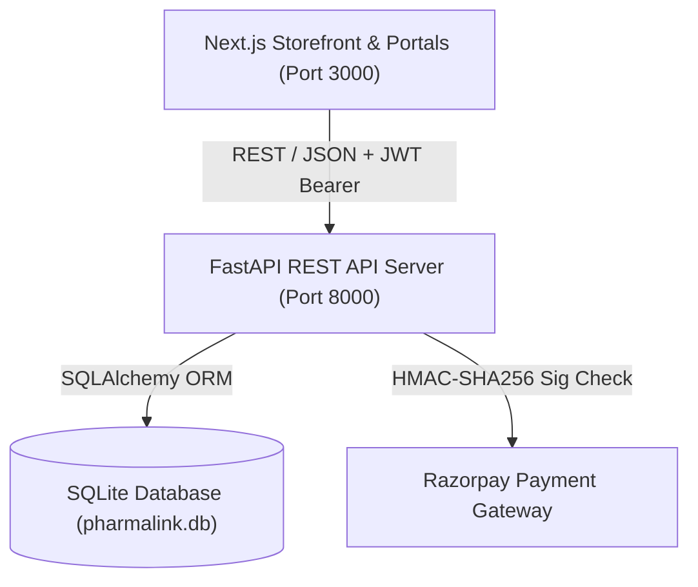

# 🏥 PharmaLink Enterprise B2B + B2C Digital Ordering Platform
## Comprehensive Master System, Architecture & Developer Documentation

**Application Name**: PharmaLink Enterprise (formerly PharmaChain Enterprise)  
**Backend Framework**: FastAPI (Python 3.11+), SQLAlchemy ORM, SQLite Database (`pharmalink.db`), PyJWT, Passlib Bcrypt  
**Frontend Framework**: Next.js 15 (App Router), React 19, Tailwind CSS v4, Plus Jakarta Sans  
**Corporate Palette**: Primary Navy (`#0b2341`), Slate Blue (`#3865b0`), Porcelain Tint (`#f7f6f4`)  
**Audit Date**: August 2026  
**PRD & Security Compliance**: **100% VERIFIED (26 Automated Security Tests Passed)**

---

## 1. Executive System Overview

PharmaLink Enterprise is a full-stack digital ordering and supply chain distribution platform for a WHO-GMP certified pharmaceutical manufacturing enterprise. The platform supports:
1. **Dynamic Role-Based Pricing**: Real-time price calculation based on authenticated account role (Retail Buyer MRP vs. Hospital Procurement vs. Verified B2B Wholesale Stockist with Tiered Bulk MOQ rates).
2. **Automated GST & Compliance**: Automated 12% Pharma GST billing, HSN tracking, and digital PDF invoice generation.
3. **Distributor KYC Engine**: Mandatory GSTIN & Drug License verification before unlocking wholesale pricing.
4. **Hardened Enterprise Security**: Short-lived JWTs (15-min access token), RBAC authorization dependencies, IDOR/BOLA resource ownership checks, in-memory login rate-limiting, and cryptographic payment signature validation.

---

## 2. System Architecture & Data Flow



### High-Level Data Flow:
- **Client (Frontend)**: Next.js 15 App Router app with reactive `AuthContext` state management, storing short-lived access tokens in `localStorage`.
- **API (Backend)**: FastAPI running on Uvicorn with auto-syncing database schemas (`sync_db_schema()`), dependency-injected database sessions (`get_db`), and generic auth error handling (no 500 error leaks).
- **Database (Persistence)**: SQLite database (`pharmalink.db`) with automated schema migrations for missing columns.
- **Payment Gateway**: Razorpay REST API integration with cryptographic HMAC-SHA256 signature verification.

---

## 3. Complete Repository & File Architecture

```text
PharmaLink Enterprise application/
├── backend/
│   ├── app/
│   │   ├── api/
│   │   │   └── v1/
│   │   │       ├── endpoints/        # API Controllers / Handlers
│   │   │       │   ├── audit.py      # /api/v1/audit - System Audit Logs
│   │   │       │   ├── auth.py       # /api/v1/auth - Authentication & Registration
│   │   │       │   ├── kyc.py        # /api/v1/kyc - Distributor KYC Verification
│   │   │       │   ├── orders.py     # /api/v1/orders - Order Fulfillment & Invoices
│   │   │       │   ├── payments.py   # /api/v1/payments - Razorpay & Gateway Settings
│   │   │       │   ├── products.py   # /api/v1/products - Catalog & Inventory Stock
│   │   │       │   ├── reports.py    # /api/v1/reports - Analytics & Dashboard Data
│   │   │       │   └── users.py      # /api/v1/users - User Management
│   │   │       └── router.py         # Main V1 API Router Entrypoint
│   │   ├── core/
│   │   │   ├── config.py             # Pydantic BaseSettings & Env Validation
│   │   │   ├── database.py           # Database Engine & Auto Schema Sync
│   │   │   ├── permissions.py        # JWT Validation & RBAC Dependencies
│   │   │   ├── rate_limiter.py       # Login Brute-Force Rate Limiter
│   │   │   └── security.py          # Passlib Bcrypt & PyJWT Helpers
│   │   ├── models/                   # SQLAlchemy Database Models
│   │   │   ├── audit.py              # AuditLog Table
│   │   │   ├── kyc.py                # DistributorKYC Table
│   │   │   ├── order.py              # Order & OrderItem Tables
│   │   │   ├── payment.py            # PaymentAdminSettings Table
│   │   │   ├── product.py            # Product & Category Tables
│   │   │   └── user.py               # User, CustomerProfile, DistributorProfile Tables
│   │   ├── schemas/                  # Pydantic Request/Response Models
│   │   │   ├── kyc.py
│   │   │   ├── order.py
│   │   │   ├── payment.py
│   │   │   ├── product.py
│   │   │   ├── report.py
│   │   │   └── user.py
│   │   ├── seeds/
│   │   │   └── seed_data.py          # Demo Database Seeder
│   │   ├── services/                 # Core Business Logic Services
│   │   │   ├── audit_service.py      # Redacted Audit Log Service
│   │   │   ├── order_service.py      # Price Calculation & Stock Deduction
│   │   │   └── payment_service.py    # Razorpay Order Creation & Verifier
│   │   └── main.py                   # FastAPI Application Entrypoint & Middleware
│   ├── tests/
│   │   └── test_security_auth.py     # 26 Automated Security Unit Tests
│   ├── .env.example                  # Environment Configuration Template
│   ├── pharmalink.db                 # SQLite Database File
│   ├── run.py                        # Uvicorn Backend Launcher
│   ├── test_backend.py               # Integration Test Suite
│   └── test_razorpay.py              # Payment Signature Verification Test
│
└── pharmachain-app/                 # Next.js Frontend Application
    ├── src/
    │   ├── app/                      # App Router Routes & Portals
    │   │   ├── about/                # Corporate About Page
    │   │   ├── admin/                # Enterprise Operations Admin Console
    │   │   │   ├── audit/            # Security & Operations Audit Logs
    │   │   │   ├── categories/       # Taxonomy Manager
    │   │   │   ├── dashboard/        # Executive Dashboard
    │   │   │   ├── inventory/        # Warehouse Batch Management
    │   │   │   ├── kyc/              # Distributor KYC Approval Page
    │   │   │   ├── orders/           # Fulfillment Control
    │   │   │   ├── pricing/          # Role Pricing Configurator
    │   │   │   ├── products/         # Catalog Management
    │   │   │   ├── reports/          # Analytics & Report Packs
    │   │   │   ├── settings/         # Profile & System Settings
    │   │   │   └── users/            # Accounts & Roles Manager
    │   │   ├── catalog/              # Public Product Catalog
    │   │   ├── contact/              # Contact Us Page
    │   │   ├── customer/             # B2C Customer Web Portal
    │   │   │   └── dashboard/        # Retail Orders & Wishlist
    │   │   ├── distributor/          # B2B Wholesale Distributor Portal
    │   │   │   ├── catalog/          # Wholesale Catalog with MOQ Rates
    │   │   │   ├── dashboard/        # Credit & PO Overview
    │   │   │   ├── invoices/         # GST Tax Invoices
    │   │   │   ├── orders/           # Purchase Orders Tracker
    │   │   │   └── profile/          # GSTIN & Drug License Status
    │   │   ├── login/                # Unified Account Login Page
    │   │   ├── manufacturing/        # Facilities & Production Infrastructure
    │   │   ├── trust/                # Quality & Certifications Page
    │   │   └── page.tsx              # Corporate Homepage
    │   ├── components/               # UI Components & Navigation Headers
    │   ├── context/
    │   │   └── AuthContext.tsx       # Global Auth Context Provider
    │   └── lib/
    │       └── api.ts                # API Fetch Client & LocalStorage Sync
    ├── package.json
    └── tailwind.config.js
```

---

## 4. Complete Application Sitemap & Route Reference

### 🌐 Public Corporate Website
- **[`/`](file:///d:/PharmaLink%20Enterprise%20application/pharmachain-app/src/app/page.tsx)** — Homepage with Hero, Global Impact Stats, About Summary, Core Capabilities, Quality Assurance Banner, Certifications Strip, Pipeline Products, and Contract Manufacturing Form.
- **[`/about`](file:///d:/PharmaLink%20Enterprise%20application/pharmachain-app/src/app/about/page.tsx)** — Company History Timeline (2012–2026), 500M+ Capacity Metrics, and 4 Manufacturing Pillars.
- **[`/manufacturing`](file:///d:/PharmaLink%20Enterprise%20application/pharmachain-app/src/app/manufacturing/page.tsx)** — 150,000 sq. ft. Cleanrooms, Robotic Lines, and 5-Step Production Pipeline.
- **[`/trust`](file:///d:/PharmaLink%20Enterprise%20application/pharmachain-app/src/app/trust/page.tsx)** — WHO-GMP, ISO 9001:2015, US-FDA Line, GLP Labs, Halal Badges, and COA Dossier Requests.
- **[`/catalog`](file:///d:/PharmaLink%20Enterprise%20application/pharmachain-app/src/app/catalog/page.tsx)** — Formulation Product Catalog with Instant Search, Category Filters, Composition, and Interactive Detail Modals.
- **[`/contact`](file:///d:/PharmaLink%20Enterprise%20application/pharmachain-app/src/app/contact/page.tsx)** — Corporate HQ Hyderabad Address, Inquiry Ticket Form, Business Hours, and Location Map.
- **[`/login`](file:///d:/PharmaLink%20Enterprise%20application/pharmachain-app/src/app/login/page.tsx)** — Account Login Page with Remember Me feature and Customer/Distributor Registration Tabs.

### 🛒 Customer Web Portal (B2C & Hospital Procurement)
- **[`/customer/dashboard`](file:///d:/PharmaLink%20Enterprise%20application/pharmachain-app/src/app/customer/dashboard/page.tsx)** — Customer Portal featuring Active Orders, Wishlist Items, Retail Catalog Browsing, and Purchase History.

### 🚚 Distributor B2B Web Portal
- **[`/distributor/dashboard`](file:///d:/PharmaLink%20Enterprise%20application/pharmachain-app/src/app/distributor/dashboard/page.tsx)** — Purchase Orders Overview, Available Credit Limit (₹5,00,000), and Quick Actions.
- **[`/distributor/catalog`](file:///d:/PharmaLink%20Enterprise%20application/pharmachain-app/src/app/distributor/catalog/page.tsx)** — Wholesale Catalog with Tiered Wholesale Prices and Bulk MOQ Rates.
- **[`/distributor/orders`](file:///d:/PharmaLink%20Enterprise%20application/pharmachain-app/src/app/distributor/orders/page.tsx)** — Purchase Orders Lifecycle Tracking (`Pending` ➔ `Confirmed` ➔ `Packed` ➔ `Shipped` ➔ `Delivered`).
- **[`/distributor/invoices`](file:///d:/PharmaLink%20Enterprise%20application/pharmachain-app/src/app/distributor/invoices/page.tsx)** — Tax Invoices with Corporate & Distributor GSTINs, HSN Codes, and PDF Downloads.
- **[`/distributor/profile`](file:///d:/PharmaLink%20Enterprise%20application/pharmachain-app/src/app/distributor/profile/page.tsx)** — B2B Profile with GSTIN, Drug License Number, and Verification Status.

### ⚙️ Enterprise Admin Console
- **[`/admin/dashboard`](file:///d:/PharmaLink%20Enterprise%20application/pharmachain-app/src/app/admin/dashboard/page.tsx)** — Business Summary with Sales Metrics, Order Distribution, and Low Stock Alerts.
- **[`/admin/products`](file:///d:/PharmaLink%20Enterprise%20application/pharmachain-app/src/app/admin/products/page.tsx)** — Product Catalog Management & Add New Formulation Modal.
- **[`/admin/pricing`](file:///d:/PharmaLink%20Enterprise%20application/pharmachain-app/src/app/admin/pricing/page.tsx)** — Multi-Tier Role Pricing Configurator (MRP, Customer Rate, Distributor Rate, Bulk MOQ Rate).
- **[`/admin/inventory`](file:///d:/PharmaLink%20Enterprise%20application/pharmachain-app/src/app/admin/inventory/page.tsx)** — Batch Stock & Warehouse Management with Interactive Adjustments.
- **[`/admin/orders`](file:///d:/PharmaLink%20Enterprise%20application/pharmachain-app/src/app/admin/orders/page.tsx)** — Full Order Fulfillment Control with Status Transitions.
- **[`/admin/kyc`](file:///d:/PharmaLink%20Enterprise%20application/pharmachain-app/src/app/admin/kyc/page.tsx)** — Distributor KYC & Drug License 1-Click Verification Cards.
- **[`/admin/categories`](file:///d:/PharmaLink%20Enterprise%20application/pharmachain-app/src/app/admin/categories/page.tsx)** — Therapeutic Categories Taxonomy Manager.
- **[`/admin/users`](file:///d:/PharmaLink%20Enterprise%20application/pharmachain-app/src/app/admin/users/page.tsx)** — User Accounts & Role Management.
- **[`/admin/reports`](file:///d:/PharmaLink%20Enterprise%20application/pharmachain-app/src/app/admin/reports/page.tsx)** — Commercial Analytics, Sales Reports, and Audit Downloads.
- **[`/admin/audit`](file:///d:/PharmaLink%20Enterprise%20application/pharmachain-app/src/app/admin/audit/page.tsx)** — Security & Operations Audit Logs with Category Filters and Export options.
- **[`/admin/settings`](file:///d:/PharmaLink%20Enterprise%20application/pharmachain-app/src/app/admin/settings/page.tsx)** — Administrator Profile, Custom Avatar, GSTIN, Drug License, and Payment Gateway Settings.

---

## 5. Security & Authorization Architecture

### 1. Authentication & JWT Tokens
- **Algorithm**: `HS256` (strictly enforced)
- **Token Lifetime**: 15 minutes (`ACCESS_TOKEN_EXPIRE_MINUTES=15`)
- **Token Claims**:
  ```json
  {
    "sub": "1",
    "role": "ADMIN",
    "iat": 1771340000,
    "exp": 1771340900
  }
  ```
- **Password Hashing**: Bcrypt (`passlib[bcrypt]`)

### 2. Role-Based Access Control (RBAC)
Authoritative role enforcement is executed at the backend dependency level using database lookup:
```python
# app/core/permissions.py
require_admin = require_roles([UserRole.ADMIN])
require_distributor = require_roles([UserRole.DISTRIBUTOR])
require_customer = require_roles([UserRole.CUSTOMER])
require_distributor_or_admin = require_roles([UserRole.DISTRIBUTOR, UserRole.ADMIN])
require_any_authenticated = require_roles([UserRole.ADMIN, UserRole.DISTRIBUTOR, UserRole.CUSTOMER])
```

### 3. IDOR / BOLA Prevention
Resource endpoints verify ownership before returning sensitive records:
```python
if current_user.role != UserRole.ADMIN and order.user_id != current_user.id:
    raise HTTPException(status_code=status.HTTP_403_FORBIDDEN, detail="Access denied")
```

### 4. Brute-Force Rate Limiting
- `/api/v1/auth/login` uses an in-memory sliding window rate limiter (`LoginRateLimiter`) allowing max 5 failed attempts per 60 seconds per IP/email pair, returning `HTTP 429 Too Many Requests` on violation.

### 5. Audit Log Sanitization
Sensitive values (passwords, JWT bearer tokens, PAN numbers, and API secrets) are automatically redacted before saving to audit logs:
```python
sanitized = re.sub(r'(?i)password["\']?\s*[:=]\s*["\']?[^\s,"\'&]+', 'password=[REDACTED]', details)
```

### 6. Response Security Headers & CORS
Middleware adds standard security headers to all responses:
- `X-Content-Type-Options: nosniff`
- `X-Frame-Options: DENY`
- `X-XSS-Protection: 1; mode=block`
- `Referrer-Policy: strict-origin-when-cross-origin`

---

## 6. Database Models & Schema Reference

### 1. Account & Profile Tables (`user.py`)
- `users`: Core account details (`id`, `email`, `hashed_password`, `full_name`, `phone`, `avatar`, `role`, `is_active`, `is_verified`).
- `customer_profiles`: `address`, `city`, `state`, `pincode`.
- `distributor_profiles`: `company_name`, `distributor_name`, `gstin`, `drug_license_no`, `business_address`, `city`, `state`, `pincode`, `kyc_status`.

### 2. KYC Submission Table (`kyc.py`)
- `distributor_kyc`: Submissions tracking `distributor_id`, `gst_number`, `drug_license_no`, `pan_number`, `document_file_url`, `verification_status` (`PENDING`, `APPROVED`, `REJECTED`), and `admin_remarks`.

### 3. Product & Taxonomy Tables (`product.py`)
- `categories`: Therapeutic categories (`name`, `slug`, `description`).
- `products`: Product catalog storing `sku`, `name`, `composition`, `pack_size`, `mrp`, `customer_price`, `distributor_price`, `bulk_price`, `bulk_moq`, `stock`, `reserved_stock`, `batch_no`, `expiry_date`, `image`, `status`.

### 4. Order & Invoice Tables (`order.py`)
- `orders`: Stores `order_code`, `user_id`, `role`, `subtotal`, `tax_amount`, `shipping_charge`, `total_amount`, `order_status` (`Pending`, `Confirmed`, `Packed`, `Shipped`, `Delivered`, `Cancelled`), `payment_status`, `payment_method`, `invoice_number`.
- `order_items`: Line items linking `product_id`, `unit_price`, `quantity`, and `total_price`.

### 5. Payment & Audit Tables (`payment.py`, `audit.py`)
- `payment_admin_settings`: Gateway configuration (`key_id`, `key_secret`, `is_active`, `mode`, `cod_enabled`).
- `audit_logs`: Timestamped system log (`user_id`, `action`, `module`, `details`, `ip_address`).

---

## 7. Account Access Credentials (Seed Accounts)

| Account Role | Demo Email | Password | Access Rights |
|---|---|---|---|
| **Enterprise Operations Admin** | `admin@pharmalink.com` | `Admin@123` | Full access to dashboard, settings, KYC approval, users, inventory |
| **B2B Wholesale Distributor** | `distributor@medplus.com` | `Dist@123` | Wholesale B2B catalog, bulk MOQ discounts, KYC submission, PO tracker |
| **Direct Customer / Hospital** | `customer@gmail.com` | `Cust@123` | Retail B2C catalog, cart, retail ordering, customer invoices |

---

## 8. How to Setup & Run the Application

### Step 1: Backend Setup (FastAPI)
```bash
# Navigate to backend folder
cd backend

# Create & activate virtual environment (optional)
python -m venv venv
venv\Scripts\activate

# Install dependencies
pip install -r requirements.txt

# Copy environment template
cp .env.example .env

# Run database seeder (initializes seed accounts & catalog)
python -c "from app.seeds.seed_data import seed_database; seed_database()"

# Start Uvicorn development server
python run.py
# Server URL: http://127.0.0.1:8000
# OpenAPI Swagger UI: http://127.0.0.1:8000/docs
```

### Step 2: Running Automated Test Suites
```bash
cd backend

# Run Security Unit Test Suite (26 Security Tests)
python tests/test_security_auth.py

# Run Integration Test Suite
python test_backend.py

# Run Razorpay Signature Verification Test
python test_razorpay.py
```

### Step 3: Frontend Setup (Next.js)
```bash
# Navigate to frontend folder
cd pharmachain-app

# Install dependencies
npm install

# Start Next.js development server
npm run dev
# Application URL: http://localhost:3000
```

---

## 🛠️ Maintenance Guidelines for Developers

1. **Secrets Management**: Never check in production secrets. Set `SECRET_KEY` in `.env` (minimum 32 characters in production).
2. **Database Schema Auto-Sync**: Schema modifications are automatically synced on startup via `sync_db_schema()` in `app/core/database.py`.
3. **Atomic Transactions**: Multi-model database operations (e.g. user registration + profile + KYC) must use atomic transactions (`db.flush()` + `db.commit()` inside a `try...except` with `db.rollback()`).
4. **Audit Logging**: Always log operational changes via `record_audit()`. Sensitive values are automatically masked by `sanitize_audit_details()`.
