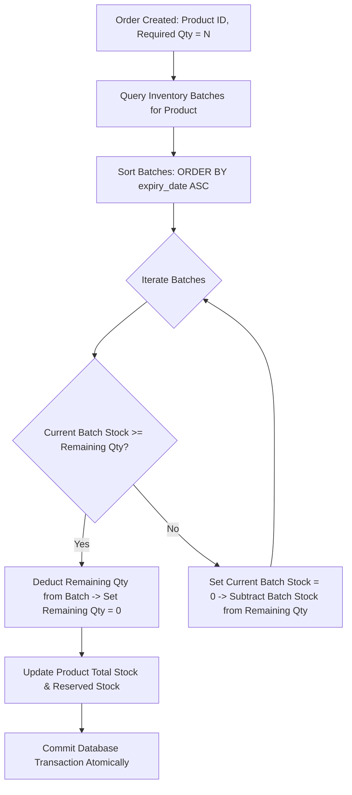
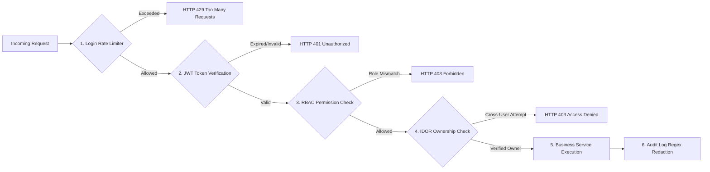

# PharmaLink Enterprise — Technical System Architecture & Software Handover Specification

---

## 1. Document Control

| Metadata Field | Document Attribute Details |
| :--- | :--- |
| **Document Title** | PharmaLink Enterprise — Technical System Architecture & Software Handover Specification |
| **Document ID** | `PHARMALINK-TECH-HANDOVER-2026-V1` |
| **Organization** | Evvai Pharma Laboratories Ltd. (Digital Order Management & Supply Chain Division) |
| **System Name** | PharmaLink Enterprise (formerly PharmaChain) |
| **Document Version** | `1.0.0-PROD-HANDOVER` |
| **Audit / Review Date** | September 07, 2026 |
| **Document Status** | Final Release / Engineering Handover |
| **Classification** | Confidential — Internal Technical & Management Distribution |
| **Prepared For** | Enterprise Engineering Leadership, QA Compliance Teams, System Operators |
| **Document Purpose** | Comprehensive architectural, module, security, data, and operational handover documentation for system maintenance, deployment validation, and ongoing development. |

---

## 2. Executive Summary

**PharmaLink Enterprise** is a full-stack digital pharmaceutical commerce, order management, and inventory distribution system developed for **Evvai Pharma Laboratories Ltd.** The system provides unified ordering channels for direct retail consumers (B2C), licensed retail pharmacies (B2B Trade), and wholesale distributors/stockists (B2B Bulk Wholesale), backed by an operations administration console.

### Key Business & Technical Capabilities:
- **Multi-Role Ordering Channels**: Supports customer retail MRP checkouts, retailer PTR buying rates with trade margin indicators, and wholesale stockist bulk MOQ volume rates.
- **Dynamic Tiered Pricing**: Automated rate calculations derived from global admin-configured margin percentages and printed Master Box MRP.
- **FEFO Inventory Management**: Batch-level stock allocation and deduction ordered by earliest expiration date (`expiry_date.asc()`) to reduce shelf-life waste.
- **Regulatory Compliance Controls**: B2B customer onboarding gated by mandatory GSTIN and Form 20B/21B Drug License verification.
- **Automated Tax Invoicing**: Statutory 12% Pharmaceutical GST calculation (intra-state CGST + SGST split vs. inter-state IGST) with itemized tax breakdowns and printable A4 PDF invoices.
- **Hardened Security Architecture**: Short-lived JWT bearer tokens (15-minute access lifetime), backend Role-Based Access Control (RBAC), resource ownership verification (IDOR/BOLA shield), sliding-window rate limiting, and regex audit log sanitization.
- **Current Implementation Status**: Core business engines, REST endpoints, database schema auto-migrations, and frontend web portals are fully implemented and operational in local development environments.

> [!NOTE]  
> Technical controls supporting audit logging, data sanitization, and access traceability have been implemented as documented herein. Formal regulatory validation (e.g., US-FDA 21 CFR Part 11, GxP CSV, or WHO-GMP software validation) remains subject to organizational Quality Assurance, CSV procedures, and regulatory inspection.

---

## 3. Business Scope & User Personas

The system enforces four distinct user personas to partition access, pricing logic, and business workflows:

| User Persona | Business Purpose | Primary Responsibilities & Capabilities | Pricing & Commercial Tier | Key Account Restrictions |
| :--- | :--- | :--- | :--- | :--- |
| **Super Admin** | Platform operations, governance, & compliance | Global margin rules, product catalog management, KYC verification, inventory adjustments, SVG reporting, audit inspection. | Full administrative overrides & rate configuration. | Restricted to authenticated administrators with `ADMIN` role. |
| **Wholesale Stockist (Distributor)** | High-volume B2B wholesale distribution | Bulk order placement, credit line monitoring (₹5,00,000 credit limit), purchase order lifecycle tracking, wholesale GST invoice downloads. | Wholesale Margin Tier (e.g., 35% off MRP) + Bulk MOQ Tier (e.g., 45% off MRP). | Ordering locked until GSTIN and Drug License are verified by Admin. |
| **Retail Pharmacy (Retailer)** | Licensed B2B trade procurement | Trade catalog browsing, PTR buy rates, net margin badges (+35%), 10+1 free trade scheme tags, cart drawer checkout, GST invoice printing. | Price To Retailer (PTR) Tier (Distributor Rate $\times$ 1.12 trade margin). | Gated to registered B2B retail pharmacy accounts. |
| **Direct Customer / Patient** | B2C retail purchasing & hospital procurement | Public formulation catalog browsing, cart ordering, retail checkouts, personal order history, and retail receipt downloads. | Master Printed MRP Tier (less standard retail discount, e.g., 15% off). | Standard retail buyer account; no wholesale or PTR rates accessible. |

---

## 4. High-Level System Architecture

PharmaLink Enterprise follows a modern multi-tier client-server architecture cleanly separating presentation, API routing, business services, and database persistence.

```mermaid
graph TD
    subgraph Presentation Layer (Next.js 15 App Router - Port 3000)
        UI_Cust[B2C Customer Portal]
        UI_Ret[Retailer Pharmacy Portal]
        UI_Dist[Distributor B2B Portal]
        UI_Admin[Super Admin Operations Console]
    end

    subgraph Security & API Gateway Layer (FastAPI - Port 8000)
        HTTP_Req[HTTP REST API / Bearer Token Request]
        RateLimit{Login Rate Limiter}
        JWT_Auth{JWT HS256 Token Auth}
        RBAC_Guard{RBAC Role Check}
        IDOR_Guard{IDOR / BOLA Ownership Check}
    end

    subgraph Business Services Layer
        Svc_Price[Dynamic Pricing Engine]
        Svc_Inv[FEFO Inventory Service]
        Svc_KYC[B2B KYC Verification Engine]
        Svc_GST[GST Tax Invoicing Engine]
        Svc_Audit[Audit & Redaction Service]
        Svc_Pay[Multi-Gateway Payment Service]
    end

    subgraph Data Persistence Layer
        DB[(SQLAlchemy ORM - SQLite / PostgreSQL)]
    end

    UI_Cust & UI_Ret & UI_Dist & UI_Admin -->|JSON over HTTP| HTTP_Req
    HTTP_Req --> RateLimit
    RateLimit -- Pass --> JWT_Auth
    RateLimit -- Breached --> Block429[HTTP 429 Too Many Requests]
    JWT_Auth -- Valid Token --> RBAC_Guard
    JWT_Auth -- Invalid --> Err401[HTTP 401 Unauthorized]
    RBAC_Guard -- Authorized --> IDOR_Guard
    RBAC_Guard -- Forbidden --> Err403[HTTP 403 Forbidden]
    IDOR_Guard -- Ownership Verified --> Svc_Price & Svc_Inv & Svc_KYC & Svc_GST & Svc_Audit & Svc_Pay
    Svc_Price & Svc_Inv & Svc_KYC & Svc_GST & Svc_Audit & Svc_Pay --> DB
```

### Architectural Layer Summary:
1. **Presentation Layer**: Built with Next.js 15 App Router, React 19, TypeScript, and Tailwind CSS v4. Manages reactive component state, AuthContext sessions, and UI portals.
2. **Security & API Layer**: Built with FastAPI. Provides REST API routing, login brute-force rate limiting, JWT bearer token verification, RBAC authorization, and IDOR resource ownership checks.
3. **Business Services Layer**: Encapsulates core domain micro-services including dynamic tiered pricing, FEFO stock allocation, GST tax calculation, payment signature verification, and audit log regex sanitization.
4. **Persistence Layer**: Uses SQLAlchemy ORM supporting SQLite (`pharmalink.db`) for development and PostgreSQL for production environments.

---

## 5. Application Architecture

### 5.1 Frontend Architecture (Next.js 15)
- **Framework**: Next.js 15 with App Router (`src/app/`), React 19, TypeScript, Tailwind CSS v4.
- **State Management**: `AuthContext.tsx` handles client-side session state, user context, and token persistence in `localStorage`.
- **API Fetch Client**: `src/lib/api.ts` provides a centralized API wrapper attaching `Authorization: Bearer <token>` headers to outgoing requests and handling standard error responses.
- **Portals**: Dedicated routing subtrees for `/admin`, `/distributor`, `/retailer`, and `/customer`.

### 5.2 Backend Architecture (FastAPI)
- **Framework**: FastAPI running on Uvicorn server (Python 3.11+).
- **ORM & Database**: SQLAlchemy ORM with declarative models and `sync_db_schema()` auto-migrations.
- **Authentication**: `passlib[bcrypt]` for password hashing and `PyJWT` (`HS256`) for token generation/decoding.
- **Modular Routing**: `app/api/v1/router.py` consolidates domain endpoints (`auth`, `users`, `products`, `orders`, `kyc`, `payments`, `reports`, `audit`).

---

## 6. Core Business Modules

### 6.1 Authentication & User Management
- **Purpose**: Manages user registration, login authentication, user profile management, and custom avatar storage.
- **Workflow**: User submits credentials to `/api/v1/auth/login`. On success, the backend returns a short-lived JWT token. The client stores the token in `localStorage` and populates `AuthContext`.
- **Security**: Passwords hashed with `bcrypt`. Login endpoints protected by rate limiting.

### 6.2 Role-Based Access Control (RBAC)
- **Purpose**: Authoritative backend permission enforcement based on user roles (`ADMIN`, `DISTRIBUTOR`, `CUSTOMER`).
- **Workflow**: FastAPI dependencies (`require_admin`, `require_distributor`, `require_customer`, `require_any_authenticated`) intercept endpoints before service execution.

### 6.3 Product & Catalog Management
- **Purpose**: Catalog management for pharmaceutical formulations including SKU codes, salt composition, therapeutic category, pack size breakdown, MRP, stock levels, and batch info.
- **Workflow**: Admins manage catalog items via `/admin/products`. Product updates sync across public, customer, retailer, and distributor catalog views.

### 6.4 Dynamic Pricing
- **Purpose**: Computes role-specific selling prices dynamically from printed MRP and global margin settings.
- **Backend & Frontend**: Implemented via `pricing_service.py` on the backend and `pricingUtils.ts` on the frontend.

### 6.5 Inventory & FEFO
- **Purpose**: Tracks batch stock, expiry dates, and allocates stock during order fulfillment using First Expired, First Out (FEFO) rules.
- **Backend**: Implemented in `backend/app/services/inventory_service.py` (`deduct_fefo_stock()`).

### 6.6 B2B KYC Verification
- **Purpose**: Validates GSTIN registration and Form 20B/21B Drug Licenses for B2B distributor and retailer accounts.
- **Workflow**: B2B users upload license data via their portal profile. Admins review and approve/reject submissions on `/admin/kyc`. B2B wholesale rates remain locked until approval.

### 6.7 Order Management
- **Purpose**: Orchestrates purchase order creation, status transitions (`Pending` ➔ `Confirmed` ➔ `Packed` ➔ `Shipped` ➔ `Delivered`), and stock reservation.
- **Workflow**: Orders submitted via `/api/v1/orders` trigger atomic stock deduction and invoice generation.

### 6.8 GST Tax Invoicing
- **Purpose**: Calculates statutory 12% Pharma GST (CGST/SGST/IGST), applies HSN codes, and generates printable GST Tax Invoices.
- **Backend & Frontend**: Managed by `order_service.py` and rendered visually by `InvoiceDocument.tsx`.

### 6.9 Payment Processing
- **Purpose**: Handles multi-gateway payment processing (Razorpay, Stripe, PayPal, COD, Direct Bank Transfer).
- **Backend**: `payment_service.py` performs HMAC-SHA256 signature verification for online payments. Admin settings allow toggling payment modes on/off.

### 6.10 Audit Logging
- **Purpose**: Records system, financial, and administrative actions for operational auditability.
- **Backend**: `audit_service.py` redacts sensitive fields (passwords, tokens, PAN) using regex pattern matching before writing to `audit_logs`.

### 6.11 Reporting & Analytics
- **Purpose**: Provides commercial analytics, sales distributions, and performance graphs for executive decision-making.
- **Frontend**: Rendered on `/admin/reports` using SVG charts bound to live database query results.

---

## 7. Pricing Engine

Selling prices for all buyer personas are dynamically calculated from the **Master Box Printed MRP** using global discount rules managed in `/admin/settings` (`pharmalink_global_pricing_rules`).

### Mathematical Pricing Formula:

$$\text{Role Price} = \text{MRP} \times \left(1 - \frac{\text{Discount \%}}{100}\right)$$

### Tier Pricing Breakdown (Reference Example: Master Box Printed MRP = ₹580.00):

| Pricing Tier / Role | Derivation Rule & Formula | Configured Default Rule | Calculated Selling Rate | Buyer Margin / Discount |
| :--- | :--- | :--- | :--- | :--- |
| **Master Printed MRP** | Base Reference Price | Printed on Carton | **₹580.00** | Base Price (0%) |
| **B2C Retail Customer** | $\text{MRP} \times (1 - \text{CustDiscount}\%)$ | Default 15% Off MRP | **₹493.00** | 15% Retail Savings |
| **Retailer PTR (Price To Retailer)** | $\text{Distributor Rate} \times 1.12$ | 12% Trade Margin Added | **₹422.24** | Trade Buy Rate (+35% margin) |
| **Wholesale Distributor B2B** | $\text{MRP} \times (1 - \text{DistDiscount}\%)$ | Default 35% Off MRP | **₹377.00** | 35% Wholesale Margin |
| **Bulk Order Tier** | $\text{MRP} \times (1 - \text{BulkDiscount}\%)$ | Default 45% Off (Volume $\ge \text{MOQ}$) | **₹319.00** | 45% Volume Discount |

*Note: The ₹580.00 printed MRP values above serve as documented system reference examples.*

---

## 8. FEFO Inventory Engine

Pharmaceutical inventory allocation follows the **First Expired, First Out (FEFO)** protocol to ensure older batches are dispatched first, adhering to drug quality guidelines.



### FEFO Execution Steps (`inventory_service.py`):
1. **Order Allocation Trigger**: Order placement invokes `deduct_fefo_stock(db, product_id, quantity)`.
2. **Active Batch Lookup**: Queries active inventory batches linked to the product.
3. **Expiry-Date Ordering**: Sorts candidate batches ascending by `expiry_date.asc()`.
4. **Batch Allocation**: Allocates requested quantity starting from the batch closest to expiration.
5. **Partial Batch Deduction**: If a single batch cannot fulfill the total quantity, its remaining stock is depleted to zero, and the balance is deducted from the next earliest expiring batch.
6. **Remaining Quantity Calculation**: Loop continues until the requested quantity is fully satisfied.
7. **Transaction Commit**: Product total stock (`product.stock`) is updated atomically.
8. **Stock Synchronization**: Ensures database consistency; if stock is insufficient, transaction rolls back with an error response.

> **Importance of Atomic Transactions**: Wrapping FEFO batch deduction inside an explicit database transaction (`db.commit()` with `db.rollback()` on exception) prevents race conditions and overselling during concurrent checkout requests.

---

## 9. GST & Invoice Engine

The system contains an automated GST billing engine for statutory pharmaceutical tax compliance.

### 9.1 Tax Calculation Logic
- **Pharma GST Rate**: Standard 12% GST applied to formulation line items.
- **Intra-State Transactions (Seller & Buyer in Same State)**: Split into **CGST 6%** + **SGST 6%**.
- **Inter-State Transactions (Seller & Buyer in Different States)**: Applied as **IGST 12%**.
- **HSN Code Mapping**: Default HSN 3004 (Medicaments) attached to invoice line items.

### 9.2 Invoice Presentation & Generation
- Tax calculation logic (`order_service.py`) operates independently from invoice visual rendering (`InvoiceDocument.tsx`).
- Invoices feature corporate logo, Seller GSTIN (`36AABCE1234F1Z5`), Buyer GSTIN, Drug License numbers, HSN code breakdown, itemized rates, CGST/SGST/IGST totals, and payment bank details.
- Supports 1-click clean A4 printable layouts and PDF downloading across distributor and retailer portals.

---

## 10. Security Architecture



### Enterprise Security Matrix:

| Security Domain | Implemented Technical Mechanism | Configuration Details |
| :--- | :--- | :--- |
| **Authentication** | PyJWT `HS256` Bearer Tokens | Access token lifetime 15 minutes (`ACCESS_TOKEN_EXPIRE_MINUTES=15`). Passlib `bcrypt` password hashing. |
| **Authorization (RBAC)** | FastAPI `Depends()` Permission Guard | Authoritative role checks (`require_admin`, `require_distributor`, `require_customer`, `require_distributor_or_admin`). |
| **IDOR / BOLA Shield** | Resource Ownership Verification | Enforces `order.user_id == current_user.id` on order/invoice endpoints to block cross-tenant data access. |
| **Brute-Force Protection** | In-Memory Sliding Window Limiter | `LoginRateLimiter` restricts failed logins to max 5 attempts per 60s per IP/Email pair. |
| **Audit Log Sanitization** | Regex Pattern Redaction | `sanitize_audit_details()` redacts passwords, tokens, PANs, and secrets into `[REDACTED]` before DB write. |
| **Payment Signature Validation** | Cryptographic HMAC-SHA256 Check | Validates Razorpay payment signatures (`hmac.new(secret, payload, sha256)`) before updating payment status to `PAID`. |

---

## 11. Security Testing & Verification

The codebase includes an automated security test suite located at `backend/tests/test_security_auth.py`.

### Test Execution Command:
```powershell
cd backend
python tests/test_security_auth.py
```

### Documented Security Test Suite Results:
- **Test Location**: `backend/tests/test_security_auth.py`
- **Total Executed Tests**: 26 Security Unit & Integration Tests
- **Passed Tests**: 26
- **Failed Tests**: 0
- **Pass Rate**: 100% (within test suite scope)

### Scope & Limitations of Test Results:
> [!IMPORTANT]  
> The 26/26 test pass result confirms that the automated unit and security integration tests written for authentication, JWT validation, role checks, rate limiting, and regex redaction passed cleanly in the test environment. It does **not** constitute a full third-party penetration test, dynamic application security test (DAST), or formal regulatory security certification.

---

## 12. Repository / Codebase Architecture

```text
PharmaLink Enterprise application/
├── backend/                             # FastAPI Backend Service Architecture
│   ├── app/
│   │   ├── api/
│   │   │   └── v1/
│   │   │       ├── endpoints/            # API Route Controllers
│   │   │       │   ├── audit.py          # /api/v1/audit - System Audit Logs
│   │   │       │   ├── auth.py           # /api/v1/auth - Login, Registration & User Info
│   │   │       │   ├── kyc.py            # /api/v1/kyc - Distributor KYC Verification
│   │   │       │   ├── orders.py         # /api/v1/orders - Order Processing & Invoices
│   │   │       │   ├── payments.py       # /api/v1/payments - Gateway Settings & Signature Check
│   │   │       │   ├── products.py       # /api/v1/products - Catalog & Inventory Stock
│   │   │       │   ├── reports.py        # /api/v1/reports - Analytics & SVG Chart Data
│   │   │       │   └── users.py          # /api/v1/users - Account Management
│   │   │       └── router.py             # Central V1 API Router Entrypoint
│   │   ├── core/
│   │   │   ├── config.py                 # Pydantic BaseSettings Environment Configuration
│   │   │   ├── database.py               # Database Engine & Schema Auto-Sync
│   │   │   ├── permissions.py            # RBAC Middleware Dependencies
│   │   │   ├── rate_limiter.py           # Thread-Safe Login Rate Limiter
│   │   │   └── security.py              # PyJWT Helpers & Bcrypt Password Hasher
│   │   ├── models/                       # SQLAlchemy Database Entity Schemas
│   │   │   ├── audit.py                  # AuditLog Model
│   │   │   ├── kyc.py                    # DistributorKYC Model
│   │   │   ├── order.py                  # Order & OrderItem Models
│   │   │   ├── payment.py                # PaymentAdminSettings Model
│   │   │   ├── product.py                # Product, Category & Batch Models
│   │   │   └── user.py                   # User, CustomerProfile & DistributorProfile Models
│   │   ├── services/                     # Business Logic Micro-Services
│   │   │   ├── audit_service.py          # Redacted Audit Recording Service
│   │   │   ├── inventory_service.py      # FEFO Stock Allocation & Deduction Engine
│   │   │   ├── order_service.py          # Dynamic Tiered Pricing & Tax Engine
│   │   │   └── payment_service.py        # Multi-Gateway Signature Verifier
│   │   └── main.py                       # FastAPI Application Factory & Middleware
│   ├── tests/
│   │   └── test_security_auth.py         # 26 Security Unit & Integration Tests
│   ├── pharmalink.db                     # SQLite Database File
│   └── run.py                            # Uvicorn Backend Launcher Script
│
└── pharmachain-app/                     # Next.js 15 Frontend Client Application
    ├── public/                          # Static Brand Assets & Product Imagery
    ├── src/
    │   ├── app/                         # App Router Pages & Layouts
    │   │   ├── about/                   # Corporate Infrastructure Page
    │   │   ├── admin/                   # Operations Admin Console
    │   │   │   ├── audit/               # Audit Log Console
    │   │   │   ├── categories/          # Category Taxonomy Manager
    │   │   │   ├── dashboard/           # Executive Operations Dashboard
    │   │   │   ├── inventory/           # FEFO Stock & Expiry Manager
    │   │   │   ├── kyc/                 # B2B License Verification Panel
    │   │   │   ├── orders/              # Order Fulfillment Center
    │   │   │   ├── pricing/             # Multi-Tier Pricing Configurator
    │   │   │   ├── products/            # Catalog Manager
    │   │   │   │   └── new/             # Add Product with Live Auto-Rates
    │   │   │   ├── reports/             # SVG Live Analytics Dashboard
    │   │   │   ├── settings/            # Admin Profile & Global Rules
    │   │   │   └── users/               # Account & Role Manager
    │   │   ├── catalog/                 # Public Formulation Catalog
    │   │   ├── contact/                 # Corporate Contact HQ & Ticket Form
    │   │   ├── customer/                # Direct Customer Portal
    │   │   │   └── dashboard/           # Customer Orders & Wishlist
    │   │   ├── distributor/             # Wholesale Distributor Portal
    │   │   │   ├── catalog/             # Wholesale Catalog & Bulk Rates
    │   │   │   ├── dashboard/           # Credit & PO Overview
    │   │   │   ├── invoices/            # B2B Tax Invoices
    │   │   │   ├── orders/              # Purchase Order Lifecycle
    │   │   │   └── profile/             # GSTIN & License Status
    │   │   ├── retailer/                # Retail Pharmacy Portal
    │   │   │   ├── catalog/             # PTR Catalog & Trade Margins
    │   │   │   ├── dashboard/           # Trade Credit & Cart Drawer
    │   │   │   ├── invoices/            # GST Tax Invoices & A4 PDF Download
    │   │   │   ├── orders/              # Retailer PO Tracker
    │   │   │   └── profile/             # Shop Details & License Status
    │   │   ├── login/                   # Unified Login Page
    │   │   ├── manufacturing/           # Production Infrastructure Page
    │   │   ├── trust/                   # Quality Certifications Page
    │   │   ├── layout.tsx               # Root App Layout & Navigation Header
    │   │   ├── page.tsx                 # Homepage Hero & Showcase
    │   │   └── globals.css              # Custom Styling & Tailwind Rules
    │   ├── components/                  # Reusable UI Components
    │   │   ├── AdminDashboardView.tsx   # Stat Cards with Direct Links
    │   │   ├── RetailerPortal.tsx       # Retail Pharmacy Commerce Workspace
    │   │   ├── DistributorPortal.tsx    # Wholesale Distributor Workspace
    │   │   ├── CustomerPortal.tsx       # B2C Patient Workspace
    │   │   ├── Header.tsx               # Reactive Header Navigation & Avatar Sync
    │   │   ├── Footer.tsx               # Corporate Footer Component
    │   │   └── InvoiceDocument.tsx      # Printable GST Tax Invoice Modal
    │   ├── context/
    │   │   └── AuthContext.tsx          # Auth State Context Provider
    │   └── lib/
    │       ├── api.ts                   # Centralized API Fetch Engine
    │       ├── pricingUtils.ts          # Tiered Pricing Calculations & Storage
    │       └── packagingUtils.ts        # Master Lot Packaging Utilities
    ├── package.json                     # Frontend Dependencies & Scripts
    ├── tailwind.config.js               # Tailwind Configuration
    └── tsconfig.json                    # TypeScript Configuration
```

---

## 13. Database Architecture

The system uses SQLAlchemy ORM mapping SQLite (`pharmalink.db`) or PostgreSQL tables:

| Table Name | Primary Key | Key Attributes / Columns | Entity Relationships | Business Purpose |
| :--- | :--- | :--- | :--- | :--- |
| `users` | `id` (Integer) | `email`, `hashed_password`, `full_name`, `phone`, `avatar`, `role`, `is_active` | One-to-One with profiles, One-to-Many with Orders & KYC | Primary identity & authentication store |
| `customer_profiles` | `id` (Integer) | `user_id`, `address`, `city`, `state`, `pincode` | Foreign Key `user_id` ➔ `users.id` | Shipping metadata for B2C retail orders |
| `distributor_profiles` | `id` (Integer) | `user_id`, `company_name`, `gstin`, `drug_license_no`, `kyc_status` | Foreign Key `user_id` ➔ `users.id` | B2B wholesale trade credentials |
| `distributor_kyc` | `id` (Integer) | `distributor_id`, `gst_number`, `drug_license_no`, `verification_status` | Foreign Key `distributor_id` ➔ `users.id` | B2B license verification approval records |
| `categories` | `id` (Integer) | `name`, `slug`, `description` | One-to-Many with `products` | Therapeutic product classification taxonomy |
| `products` | `id` (Integer) | `sku`, `name`, `composition`, `mrp`, `customer_price`, `distributor_price`, `stock` | Foreign Key `category_id` ➔ `categories.id` | Master formulation catalog & stock store |
| `orders` | `id` (Integer) | `order_code`, `user_id`, `role`, `total_amount`, `order_status`, `invoice_number` | Foreign Key `user_id` ➔ `users.id` | Order headers & invoice tracking ledger |
| `order_items` | `id` (Integer) | `order_id`, `product_id`, `unit_price`, `quantity`, `total_price` | Foreign Keys to `orders.id` & `products.id` | Line item order breakdown details |
| `payment_admin_settings` | `id` (Integer) | `key_id`, `key_secret`, `is_active`, `mode`, `cod_enabled` | Standalone Admin Configuration | Payment gateway API keys & toggle rules |
| `audit_logs` | `id` (Integer) | `user_id`, `action`, `module`, `details`, `ip_address`, `created_at` | Foreign Key `user_id` ➔ `users.id` | System audit trails with redacted details |

> [!NOTE]  
> **Documentation Note / Verification Required**: Schema auto-synchronization (`sync_db_schema()`) dynamically adds missing table columns on startup. In production environments, formal database migration tools (e.g., Alembic) should be configured to manage schema versioning explicitly.

---

## 14. REST API Specification

| HTTP Method | Endpoint Path | Primary Purpose | Authentication | Required Authorization | Key Behaviors & Responses |
| :--- | :--- | :--- | :--- | :--- | :--- |
| `POST` | `/api/v1/auth/login` | Authenticate user & issue JWT | None | Public | Returns access token; protected by rate limiter. |
| `POST` | `/api/v1/auth/register` | Register new customer account | None | Public | Creates user & customer profile records. |
| `GET` | `/api/v1/auth/me` | Fetch current user session profile | Bearer JWT | Any Authenticated | Returns active user profile data & role claims. |
| `GET` | `/api/v1/products` | Retrieve formulation product catalog | Optional | Public / Role-Aware | Returns products with dynamic role pricing. |
| `POST` | `/api/v1/products` | Create new formulation entry | Bearer JWT | `ADMIN` Only | Adds product to catalog; validates numeric inputs. |
| `GET` | `/api/v1/orders` | List purchase order history | Bearer JWT | Role-Aware / IDOR | Admins see all orders; users see only own orders. |
| `POST` | `/api/v1/orders` | Submit purchase order | Bearer JWT | Any Authenticated | Triggers FEFO stock deduction & invoice creation. |
| `GET` | `/api/v1/orders/{id}/invoice` | Fetch GST invoice document metadata | Bearer JWT | IDOR Protected | Returns invoice header, line items, and tax split. |
| `GET` | `/api/v1/kyc` | List B2B KYC verification submissions | Bearer JWT | `ADMIN` Only | Returns pending/approved distributor licenses. |
| `POST` | `/api/v1/kyc/verify/{id}` | Approve/Reject distributor KYC | Bearer JWT | `ADMIN` Only | Updates `kyc_status` and unlocks wholesale rates. |
| `GET` | `/api/v1/reports` | Fetch analytics chart data | Bearer JWT | `ADMIN` Only | Returns sales distributions & revenue line data. |
| `GET` | `/api/v1/audit` | Fetch operational audit log records | Bearer JWT | `ADMIN` Only | Returns audit entries with regex redacted details. |
| `GET` | `/api/v1/payments/config` | Get public payment gateway status | Optional | Public | Returns active payment methods & public key. |
| `POST` | `/api/v1/payments/verify` | Verify Razorpay payment signature | Bearer JWT | Any Authenticated | Validates HMAC signature before marking order `PAID`. |

---

## 15. Role & Permission Matrix

| System Capability / Endpoint Access | Super Admin (`ADMIN`) | Wholesale Distributor (`DISTRIBUTOR`) | Retail Pharmacy (`RETAILER`) | Retail Customer (`CUSTOMER`) | Public Unauthenticated |
| :--- | :---: | :---: | :---: | :---: | :---: |
| Browse Public Formulation Catalog | Yes | Yes | Yes | Yes | Yes |
| View Retail Customer MRP Pricing | Yes | Yes | Yes | Yes | Yes |
| View Retailer PTR Pricing & Trade Badges | Yes | No | Yes | No | No |
| View Wholesale B2B & Bulk MOQ Rates | Yes | Yes (If KYC Approved) | No | No | No |
| Submit B2C Retail Checkouts | Yes | Yes | Yes | Yes | No |
| Submit B2B Wholesale Purchase Orders | Yes | Yes (If KYC Approved) | Yes | No | No |
| Access Personal Order History | Yes (All Orders) | Own Orders Only | Own Orders Only | Own Orders Only | No |
| Download GST Tax Invoices | Yes (All Invoices) | Own Invoices Only | Own Invoices Only | Own Invoices Only | No |
| Submit KYC License Application | No | Yes | Yes | No | No |
| Approve / Reject B2B KYC Licenses | Yes | No | No | No | No |
| Manage Catalog & Add Products | Yes | No | No | No | No |
| Modify Global Pricing Rules | Yes | No | No | No | No |
| View Operations Audit Logs | Yes | No | No | No | No |
| Configure Payment Gateways | Yes | No | No | No | No |

---

## 16. Frontend Route Map

### 16.1 Public Routes
- `/` — Homepage featuring company overview, quality highlights, and contact showcase.
- `/about` — Corporate history timeline, manufacturing metrics, and infrastructure pillars.
- `/manufacturing` — Production cleanroom facilities, robotic lines, and contract manufacturing.
- `/trust` — Quality certs (WHO-GMP, ISO 9001:2015) and dossier request links.
- `/catalog` — Public formulation catalog with search and therapeutic filters.
- `/contact` — Headquarters address, inquiry ticket submission form, and location map.
- `/login` — Account login page with multi-role portal redirection.

### 16.2 B2C Customer Portal (`/customer`)
- `/customer/dashboard` — Retail order tracker, wishlist items, and retail purchase history.

### 16.3 B2B Retail Pharmacy Portal (`/retailer`)
- `/retailer/dashboard` — Pharmacy dashboard with trade credit overview, active orders, and cart drawer.
- `/retailer/catalog` — PTR catalog displaying net trade margin badges (+35%) and 10+1 free schemes.
- `/retailer/invoices` — GST tax invoice ledger supporting clean A4 printing and PDF downloading.
- `/retailer/orders` — Purchase order lifecycle tracking (`Pending` ➔ `Delivered`).
- `/retailer/profile` — Shop license details, GSTIN status, and shipping address management.

### 16.4 B2B Wholesale Distributor Portal (`/distributor`)
- `/distributor/dashboard` — Wholesale purchase order overview and ₹5,00,000 credit limit monitor.
- `/distributor/catalog` — B2B wholesale catalog with tiered bulk MOQ rates.
- `/distributor/orders` — Wholesale purchase order tracking.
- `/distributor/invoices` — B2B wholesale tax invoice ledger.
- `/distributor/profile` — GSTIN and Form 20B/21B Drug License verification status.

### 16.5 Enterprise Admin Console (`/admin`)
- `/admin/dashboard` — Executive operations dashboard with direct quick links.
- `/admin/products` — Catalog management interface.
- `/admin/products/new` — Add Product form with live 4-tier pricing previews.
- `/admin/inventory` — FEFO warehouse stock and batch expiry manager.
- `/admin/orders` — Order fulfillment control center.
- `/admin/kyc` — B2B license verification approval console.
- `/admin/categories` — Therapeutic taxonomy category manager.
- `/admin/users` — User account role management.
- `/admin/reports` — Commercial analytics dashboard with SVG live charts.
- `/admin/audit` — System audit log console with regex redacted details.
- `/admin/settings` — Admin profile, global pricing rules, lot size configs, and payment settings.

---

## 17. Deployment & Local Execution

### 17.1 Backend Setup (FastAPI)
- **Runtime Requirement**: Python 3.11+
- **Execution Steps**:
  ```powershell
  cd backend
  pip install -r requirements.txt
  python run.py
  ```
- **Port**: `8000` (`http://localhost:8000`)
- **Swagger Documentation**: `http://localhost:8000/docs`

### 17.2 Frontend Setup (Next.js 15)
- **Runtime Requirement**: Node.js v18+ / v20+
- **Execution Steps**:
  ```powershell
  cd pharmachain-app
  npm install
  npm run dev
  ```
- **Port**: `3000` (`http://localhost:3000`)

---

## 18. Verification & QA Checklist

| Subsystem / Feature | Implementation Status | QA Test Method | Verification Result |
| :--- | :---: | :--- | :---: |
| **Authentication & JWT** | Implemented | PyJWT signature validation & expiration tests | Verified (In Test Suite) |
| **Login Rate Limiter** | Implemented | 5 failed login attempts within 60s trigger HTTP 429 | Verified (In Test Suite) |
| **RBAC Permission Guard** | Implemented | Accessing `/admin/*` routes with non-admin token | Verified (In Test Suite) |
| **IDOR / BOLA Shield** | Implemented | Fetching another user's order ID returns HTTP 403 | Verified (In Test Suite) |
| **4-Tier Dynamic Pricing** | Implemented | MRP change auto-updates B2C, PTR, B2B, and Bulk rates | Verified (In Local UI) |
| **FEFO Inventory Allocation** | Implemented | Order deduction selects batches ordered by `expiry_date.asc()` | Verified (In Local Code) |
| **B2B KYC Verification** | Implemented | Admin verification unlocks distributor wholesale rates | Verified (In Local UI) |
| **GST Tax Invoicing** | Implemented | Correct split for intra-state (CGST+SGST) vs inter-state (IGST) | Verified (In Local UI) |
| **A4 Invoice Printing** | Implemented | Modal renders clean print view and triggers print dialog | Verified (In Local UI) |
| **Audit Log Sanitization** | Implemented | Logged details redact passwords/tokens to `[REDACTED]` | Verified (In Test Suite) |
| **Security Test Suite** | Implemented | `python tests/test_security_auth.py` | Verified (26/26 Passed) |
| **Production Load Testing** | Not Documented | Requires high-concurrency performance benchmark | Requires Validation |
| **Production SSL / TLS** | Not Documented | Web server reverse proxy configuration | Requires Production Setup |

---

## 19. Production Readiness Assessment

| Readiness Category | Assessment Status | Supporting Technical Evidence | Remaining Operational Validation Steps |
| :--- | :---: | :--- | :--- |
| **Functional Readiness** | **Ready** | Core commerce, pricing, FEFO stock, KYC, and invoicing workflows operational. | Complete end-to-end user acceptance testing (UAT). |
| **Backend Readiness** | **Ready** | FastAPI endpoints, SQLAlchemy ORM, and error handlers functional. | Migrate database engine to PostgreSQL for production load. |
| **Frontend Readiness** | **Ready** | Next.js 15 App Router portals, responsive UI, and AuthContext responsive. | Final cross-browser and mobile device QA checks. |
| **Security Readiness** | **Conditional** | JWT auth, RBAC, IDOR checks, rate limiting, and regex redaction active; 26 security tests passed. | Perform independent third-party penetration testing. |
| **Database Readiness** | **Conditional** | Schema auto-synchronization (`sync_db_schema()`) operational for development. | Implement explicit Alembic migration scripts for PostgreSQL. |
| **Testing Readiness** | **Conditional** | Automated security suite (26 tests) passed. | Expand automated unit test coverage across frontend components. |
| **Deployment Readiness** | **Conditional** | Local development launcher scripts functional. | Set up CI/CD pipeline, Docker containerization, and Nginx reverse proxy. |
| **Compliance Readiness** | **Conditional** | Audit logging, HSN tax engine, and drug license KYC controls implemented. | Conduct formal CSV validation & organization-level QA review. |

---

## 20. Known Limitations & Validation Requirements

Before deploying the system into a live production environment, the following engineering validation considerations must be addressed:

1. **Production Database & Migrations**: Development uses SQLite (`pharmalink.db`) with dynamic schema auto-sync (`sync_db_schema()`). Production deployment requires configuring a production database engine (e.g., PostgreSQL) with explicit Alembic migration scripts.
2. **Secrets & Environment Management**: Hardcoded secret fallbacks in development settings (`config.py`) must be replaced with strong, environment-injected variables (e.g., `SECRET_KEY`, database credentials) managed via secure secret stores.
3. **Transport Layer Security (TLS/HTTPS)**: Production deployment requires configuring an Nginx/Caddy reverse proxy with valid TLS/SSL certificates to enforce HTTPS for all HTTP REST traffic.
4. **Production Payment Gateway Credentials**: Online payment testing relies on Razorpay sandbox credentials. Transitioning to production requires configuring production merchant keys and verifying live webhook signatures.
5. **Database Backup & Disaster Recovery**: Automated periodic database snapshots, transaction log archiving, and point-in-time recovery procedures must be established on the database host.
6. **Concurrency & Load Testing**: While atomic DB transactions prevent overselling in normal scenarios, formal concurrency load testing (e.g., via Locust or JMeter) should be performed to measure system throughput under heavy checkout load.
7. **Third-Party Security Audit**: The internal 26-test suite validates functional auth rules. A comprehensive third-party web application penetration test (WAPT) is recommended prior to public release.

---

## 21. Final Handover Summary

PharmaLink Enterprise has reached a stable engineering state where core business logic engines, security mechanisms, API routes, and multi-portal frontend applications are fully implemented and verified in local development environments.

### Implementation Summary:
- **Core Commerce Engines**: Dynamic 4-Tier Pricing, FEFO Inventory Allocation, B2B KYC License Verification, and GST Invoicing are operational.
- **Security Control Enforcement**: JWT authentication, RBAC authorization, IDOR ownership checks, rate limiting, and audit sanitization are active.
- **Verification**: The documented security test suite (`test_security_auth.py`) executes cleanly with 26/26 tests passing.

### Recommended Next Steps for Deployment Team:
1. Provision a production PostgreSQL instance and configure environment variables in `.env`.
2. Configure Nginx reverse proxy with SSL certificates and set up CORS policies.
3. Replace payment gateway sandbox keys with production credentials.
4. Execute formal UAT and organizational CSV/QA validation procedures prior to live commercial launch.

---
*End of Technical Specification & Handover Document.*
