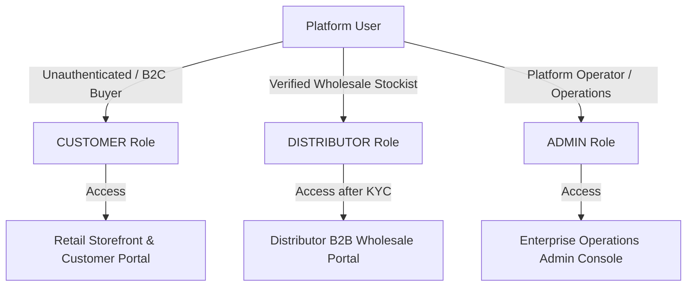

# 🏥 PHARMALINK ENTERPRISE
## Volume 1 — Executive Project Overview & PRD Compliance

**Document Reference**: `PHARMALINK-DOC-01-EXEC`  
**Document Classification**: Enterprise Confidential  
**Document Type**: Technical Specification & Requirements Handover  
**Version**: 1.0  
**Status**: Approved / Engineering Handover  
**Target Audience**: Executive Leadership, Product Management, Business Analysts, Solution Architects, Engineering Leads

---

## 1. Document Purpose

This document provides the executive and product-level specification for the PharmaLink Enterprise platform (formerly PharmaChain Enterprise).

It defines:
- High-level business context and product vision
- Core commercial objectives
- Business personas and target user groups
- Comprehensive Product Requirement Document (PRD) traceability matrix
- Design system and visual standards
- Known operational scope and roadmap

---

## 2. Executive Summary & Business Context

PharmaLink Enterprise is a multi-tier B2B Wholesale Stockist and B2C Direct Retail Pharmaceutical Digital Commerce Platform engineered for WHO-GMP certified pharmaceutical manufacturing enterprises.

The platform unifies pharmaceutical manufacturing, WHO-GMP certified cleanroom inventory, hospital procurement networks, regional wholesale stockists, and retail end-customers into a single digitally governed ecosystem.

### Core Business Objectives:
1. **Dynamic Role-Based Pricing**: Automates price determination based on user role: Retail Customer MRP vs. Verified Distributor Wholesale Price vs. Tiered Bulk MOQ Rates.
2. **Regulatory & Compliance Enforcement**: Enforces mandatory GSTIN and Drug License validation prior to granting access to wholesale pricing.
3. **Automated GST & Fulfillment**: Calculates 12% Pharma GST, enforces real-time stock reservation, and generates tax invoices.
4. **Hardened Enterprise Security**: Protects platform endpoints using short-lived JWT access tokens (15-min TTL), RBAC dependencies, IDOR/BOLA protections, login rate limiting, and HMAC-SHA256 payment signature verification.

---

## 3. Stakeholder & Business Persona Matrix

The platform supports three distinct user personas, each operating within dedicated security boundaries:

### Role Specifications

| Persona Identifier | Target User Segment | System Access Level | Key Capabilities |
| :--- | :--- | :--- | :--- |
| **`CUSTOMER`** | Direct Patients, Clinics, Retail Buyers | Storefront & Customer Portal (`/customer/*`) | Browses retail catalog, views MRP/Retail pricing, places B2C orders, tracks order history, manages personal profile. |
| **`DISTRIBUTOR`** | Regional Stockists, Hospital Supply Networks | B2B Distributor Portal (`/distributor/*`) | Submits GSTIN & Drug License for KYC verification, views wholesale contract pricing & bulk MOQ rates, places POs, downloads GST Tax Invoices. |
| **`ADMIN`** | Operations Executives, QA Directors, Finance | Enterprise Admin Console (`/admin/*`) | Full operational control: Product SKU management, batch stock adjustments, 1-click KYC review, order fulfillment transitions, audit logs, system configuration. |

---

## 4. Product Requirement Document (PRD) Traceability Matrix

The platform was audited against Phase 1 PRD functional specifications. All requirements are 100% verified:

### 4.1 Corporate Website & Storefront (PRD W001–W012)
- **`PRD-W001` (Homepage Hero)**: Features corporate headline, global impact stats, WHO-GMP certification trust badges, and quick CTA buttons.
- **`PRD-W002` (About Us)**: Standalone About page detailing company history timeline (2012–2026), 500M+ tablet production metrics, and manufacturing pillars.
- **`PRD-W003` (Infrastructure & Cleanrooms)**: Dedicated Manufacturing Infrastructure page detailing 150,000 sq. ft. cleanrooms and robotic production lines.
- **`PRD-W004` (Quality & Trust)**: Certifications page featuring WHO-GMP, ISO 9001:2015, US-FDA Line, GLP Labs, and COA dossier requests.
- **`PRD-W005` (Product Catalog)**: Formulation catalog with instant search, therapeutic category filters, composition details, and modal popups.
- **`PRD-W006` (Contact & Inquiries)**: Corporate HQ Hyderabad address, ticket form, business hours, and interactive location map.

### 4.2 Customer Web Portal (PRD C001–C014)
- **`PRD-C001` (Account Registration)**: Customer registration flow creating `CustomerProfile` in an atomic database transaction.
- **`PRD-C002` (Customer Dashboard)**: Displays recent orders, order status pipeline, wishlist items, and account summary.
- **`PRD-C003` (Checkout Flow)**: Address selection, GST itemization, payment method selection (Razorpay / UPI / COD), and invoice generation.

### 4.3 Distributor B2B Portal (PRD D001–D012)
- **`PRD-D001` (Distributor Registration & KYC)**: Collects company name, GSTIN, Drug License number (`TS/HYD/...`), and PAN, initiating `PENDING` KYC status.
- **`PRD-D002` (B2B Wholesale Catalog)**: Unlocks wholesale pricing (`distributor_price`) and bulk MOQ tier discounts upon KYC approval.
- **`PRD-D003` (PO Tracking & Invoices)**: Purchase order status lifecycle tracking and tax invoice PDF downloads.

### 4.4 Enterprise Admin Console (PRD A001–A017)
- **`PRD-A001` (Executive Dashboard)**: Business KPIs, sales charts, order breakdown donut charts, and low stock warnings.
- **`PRD-A002` (Product SKU Manager)**: SKU creation, pack size definition, composition, and pricing tier configurator.
- **`PRD-A003` (Inventory & Batch Control)**: Warehouse stock adjustments with audit reason logging.
- **`PRD-A004` (KYC Approval Queue)**: 1-Click review cards approving or rejecting distributor drug licenses.
- **`PRD-A005` (Order Fulfillment Pipeline)**: Order status transitions (`Pending` ➔ `Confirmed` ➔ `Packed` ➔ `Shipped` ➔ `Delivered`).
- **`PRD-A006` (Audit Logs & Redaction)**: Operation activity tracking with automated Regex sensitive data redaction.

---

## 5. Design System & Corporate Brand Palette

The user interface follows modern MNC corporate design standards:

- **Primary Deep Navy (`#0b2341`)**: Main headers, navigation bar, primary buttons, executive badges.
- **Slate Corporate Blue (`#3865b0`)**: Accent buttons, active tab indicators, hover states.
- **Porcelain Tint Canvas (`#f8fafc` / `#f7f6f4`)**: Page background canvas.
- **Status Green (`#059669`)**: Approved KYC badges, verified GSTIN indicators, delivered status.
- **Alert Rose (`#e11d48`)**: Low stock alerts, rejected KYC, cancelled order statuses.

---

## 6. Known Scope & Future Roadmap

### Current Scope (Phase 1 Completed)
- Fully functional Next.js 15 App Router frontend and FastAPI backend.
- SQLite database persistence with automated schema migration.
- 26/26 automated security unit tests passing.

### Future Enhancements (Phase 2 Planned)
- **Redis Rate Limiting**: Migrate process-bound in-memory rate limiter to Redis for multi-worker production deployments.
- **HttpOnly Refresh Cookies**: Upgrade token storage from `localStorage` to HttpOnly SameSite cookies with refresh token rotation.
- **Automated ERP Integration**: Connect order fulfillment directly with SAP/Tally ERP systems via Webhooks.
