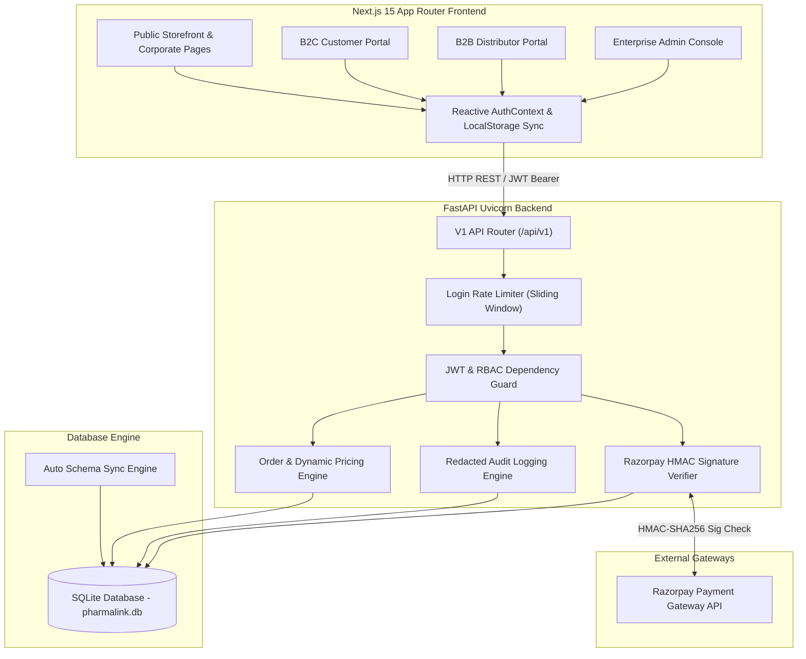
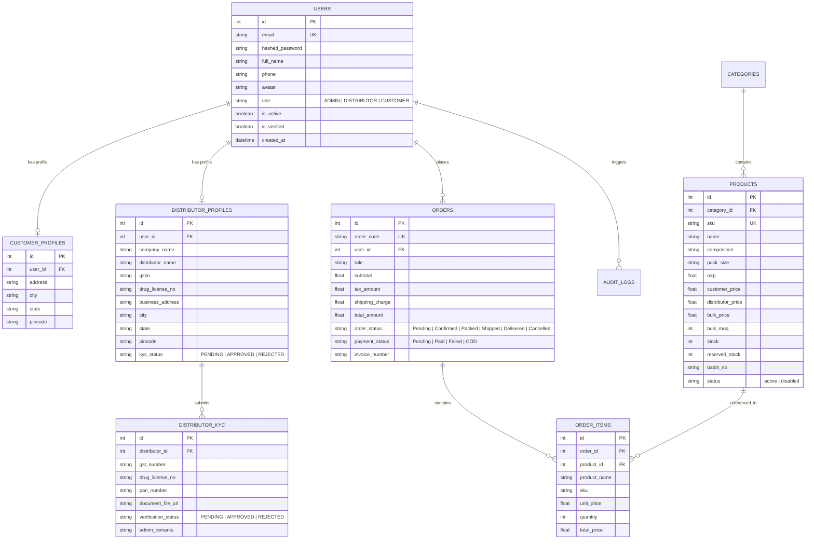

# 🏗️ PHARMALINK ENTERPRISE
## Volume 2 — System Architecture & Infrastructure

**Document Reference**: `PHARMALINK-DOC-02-ARCH`  
**Document Classification**: Enterprise Confidential  
**Document Type**: Architectural Specification & System Design Handover  
**Version**: 1.0  
**Status**: Approved / Engineering Handover  
**Target Audience**: Solution Architects, Lead Engineers, Infrastructure & Operations Teams, Security Auditors

---

## 1. Document Purpose

This document defines the complete technical architecture, component topology, data flow, database entity-relationship (ER) schemas, and module design for the PharmaLink Enterprise platform.

---

## 2. Architecture Principles & Design Goals

1. **Decoupled API-First Design**: The frontend React/Next.js UI communicates with the FastAPI backend strictly via JSON REST APIs using JWT Bearer tokens.
2. **Stateless Authentication**: Server sessions are stateless; authorization is evaluated per-request via JWT claims verified against database roles.
3. **Database Integrity & Schema Sync**: Database tables are modeled via SQLAlchemy ORM; schema changes are automatically migrated on startup using `sync_db_schema()`.
4. **Defense-in-Depth Security**: Multiple layers of security (Rate limiting ➔ JWT validation ➔ DB Role lookup ➔ Resource ownership check ➔ Regex audit redaction).

---

## 3. High-Level System Topology & Context

---

## 4. Database Entity-Relationship (ER) Schema

---

## 5. Core Backend Module Architecture

### 5.1 `app/core/config.py` (Configuration Management)
- Uses Pydantic `BaseSettings` for type-safe environment variable parsing.
- Enforces strict security validation: If `ENVIRONMENT == "production"`, validates that `SECRET_KEY` is at least 32 characters long and rejects default placeholder values.

### 5.2 `app/core/permissions.py` (Authorization Guard)
- Extracts JWT token from HTTP `Authorization: Bearer <token>` header via `OAuth2PasswordBearer`.
- `get_current_user`: Decodes JWT using `HS256`, validates expiration, extracts `sub` (user ID), and loads active user record from database.
- `require_roles`: Dependency factory enforcing authoritative database role (`current_user.role`).
- `get_current_user_optional`: Safely resolves requesting user if token exists; returns `None` gracefully for unauthenticated calls without raising HTTP 500 errors.

### 5.3 `app/core/rate_limiter.py` (In-Memory Login Rate Limiter)
- Thread-safe sliding window rate limiter tracking failed login attempts per `(client_ip, email)` key over a 60-second window.
- Exceeding 5 failed attempts triggers `HTTP 429 Too Many Requests`.

---

## 6. Frontend Next.js 15 App Architecture

- **App Router Layouts**: Separates public pages (`/app/(public)`), customer portal (`/app/customer`), distributor portal (`/app/distributor`), and admin console (`/app/admin`).
- **Global Auth Context (`AuthContext.tsx`)**: Provides global reactive state for `user`, `login()`, `logout()`, `updateProfile()`, and synchronization across browser tabs.
- **API Client (`lib/api.ts`)**: Unified fetch wrapper attaching Bearer headers automatically, handling errors, and firing reactive window events (`pharmalink_user_updated`).
